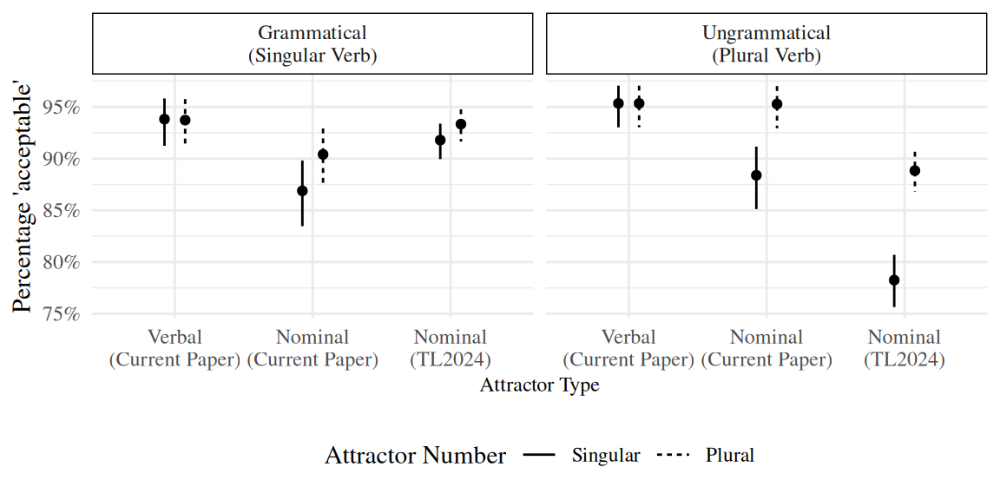
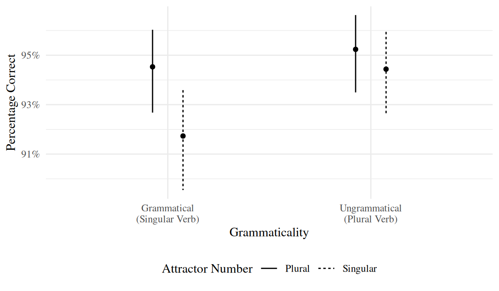

::: {.cell}

:::

::: {.cell}

:::


# Introduction

Human sentence processing draws on abstract grammatical features and on heuristics that exploit surface regularities, such as plausibility [@SpeerClifton1998], frequency [@LauEtAl2007], and task-specific factors [@LauraMalsbug24; @ArehalliWittenberg2021; @HammerlyEtAl2019; @LogacevVasishth2016].  We focus on one such heuristic: over-reliance on surface form, evidenced when phonological similarity between sentence constituents is observed to modulate performance [@AchesonMacDonald2011;@KushEtAl2015;@CopelandRadvansky2001; @RastleDavis2008]. Prior work shows reliable slowdowns and comprehension accuracy costs due to surface-form overlap, but it is unresolved whether this heuristic penetrates dependency resolution itself--including subject-verb agreement, pronoun resolution, or the licensing of negative polarity items--beyond general effects on reading ease and memory. The few studies that bear directly on subject-verb agreement exhibit contradictory findings [@BockEberhard1993;@Slioussar2018].


A central question for understanding human cognition is what information is encoded and later available to memory during comprehension, and how faithful these encodings are to the input. 'Good-Enough' and noisy channel accounts argue that detailed analyses are not always maintained when heuristics suffice, creating the opportunity for surface regularities to affect judgments [@FerreiraEtAl2002]. More specifically, general cue-based retrieval approaches hold that constituents are stored with detailed abstract features and later accessed by matching retrieval cues, and that erroneous parses can occur when features conflict or interfere. However, it remains open whether phonological codes are used as such cues during syntactic dependency building [@LV05], or even whether they persist long enough to do so. Determining whether surface-form overlap modulates dependency resolution provides a window into what human cognition counts as diagnostic information for retrieving dependency controllers and how faithful the stored representations are.

Agreement is an ideal case study because its computations are known to be sensitive to feature overlap. Classic findings demonstrate systematic errors in establishing number agreement between a verb and its agreement controller when an NP with a different number (the attractor) interferes, observed when speakers produce sentences like (\ref{og}) or misclassify them as acceptable [@BockMiller:1991; @PearlmutterGarnseyBock:1999]. 


```{=latex}
\begin{exe}
\ex[*]{\label{og} The player on the courts are tired from a long-game.}
\end{exe}
```


Despite much research on what factors modulate agreement errors, the role of phonology remains unclear. Pseudoplural attractors whose phonological offset matches the plural suffix (e.g. *course*) do not increase agreement errors in production [@BockEberhard1993]. Phonological overlap effects have been observed in other cases, but many of them involve additional shared morphological features [@HartsuikerEtAl2003; @LagoEtAl2019 ;@BleotuDillon2024], although not all [@Slioussar2018]. This raises the possibility that surface form affects the formation of agreement dependencies not directly through the use of number form as a retrieval cue, but indirectly, when the surface form is one that is more likely to be realized on agreement controllers.

Here we test this hypothesis by utilizing the surface-form overlap between the verbal and nominal morphological reflexes of agreement that happens to occur in Turkish. Turkish uses the same surface suffix, *-lAr*, for plural marking on nouns and for plural agreement on finite verbs.  Crucially, strings bearing verbal *-lAr* can occur in subject position, yet they never control finite clause agreement; only nominal plurals do. These properties allow a direct test of whether form overlap alone causes agreement errors, or whether form overlap effects must be mediated by an element that can in principle serve as an agreement controller (true of nouns but not verbs). Across two high-powered speeded acceptability experiments in Turkish we find that plural marking on an embedded verbal attractor does not increase acceptance of plural agreement on the matrix verb; such effects are only observed when the plural marker appears on a non-subject noun attractor.  These results indicate that surface-form overlap alone does not function as a retrieval cue for agreement in Turkish. Dependency resolution appears to rely on abstract features and structural relations, with phonology influencing processing primarily outside of retrieval.


## Background

Agreement has been a central domain of investigation for language processing research on memory. Across the world's languages, morphological marking of agreement between a sentential verb and one or more of its arguments—termed the agreement controller—is extremely common; one survey reports that native speakers from 296 of out 378 languages surveyed exhibit systematic agreement between the verb and another constituent(s) [@WALS]. However, this agreement process is not always reliable. In their seminal work, @BockMiller:1991 showed that participants produce reliably more erroneous non-controller-matching plural verb forms in English when an embedded 'attractor' noun was plural—for example, producing a plural-marked continuation such as are instead of is occurs more often after (\ref{true-pl}) than (\ref{true-sg}). The effect of the number mismatching attractor, agreement attraction, has also been found to be robust in comprehension [@NicolEtAl1997; @PearlmutterGarnseyBock:1999] of such sentences in various languages, including Arabic [@TuckerEtAl:2015], Armenian [@AvetisyanEtAl:2020], Hindi [@BhatiaDillon2022], Spanish [@LagoEtAl2015], Russian [@Slioussar2018], and Turkish [@LagoEtAl2019;@TurkLogacev2024;@Ulusoy2023].  


```{=latex}
\begin{exe}
\ex \label{initial}
\begin{xlist}
    \ex \label{true-sg} {Singular Attractor} \\ The {player} on the {court} \ldots{}
    \ex \label{true-pl} {Plural Attractor} \\ The {player} on the {courts} \ldots{}
\end{xlist}
\end{exe}
```


Many studies have investigated the various syntactic and semantic factors which make agreement errors more or less likely. These factors include hierarchical distance [@HatsuikerEtAl2001; @NicolEtAl1997; @Kaan2002], linear distance [@Pearlmutter2000; @BockCutting1992], semantic interactions of nouns involved [@Eberhard1999; @ViglioccoEtAl95; @HumphreysBock2005], and syntactic category of the phrase containing the attractor [@BockMiller:1991; @BockCutting1992]. One widely accepted set of accounts that attempted to capture these error profiles is called retrieval based theories [@LV05;@WagersEtAl:2009]. In these accounts, participants have a faithful representation of the constituents they process, and that errors arise because they are misled by the memory mechanisms they use to identify the agreement controller. Under this approach, phrases are encoded in a content-addressable memory as bundles of features called *chunks* which include information like, number, gender, and syntactic information [@SmithVasishth2020].  Participants predict the number of the verb based on the noun phrases they process while reading the previous noun phrases.  In grammatical sentences with singular verb agreement, the number prediction and the verb number match, which causes no processing difficulty.  In contrast, when participants fail to find the predicted number morphology on the verb, a memory-retrieval process is initiated.  This process activates the search for a chunk matching relevant cues for agreement controller.  

What is the characteristics of cues which are found useful to be encoded? One line of work manipulated overt case marking on attractors to test whether morphophonological case is used for dependency resolution. For example, @HartsuikerEtAl2003 used the syncretic homophony between nominative/accusative and singular/plural forms of feminine determiners in German, comparing these ambiguous forms to distinctly marked dative forms. Participants produced more agreement errors when the preambles contained two noun phrases whose determiners were ambiguously marked (*die*), compared to cases where the attractor case could be distinguished by form alone (*den*). Furthermore, this additive effect was limited to feminine nouns, the only gender showing nominative–accusative syncretism in plural forms, while nouns of other grammatical genders showed the base effect of plural.

However, results from other languages with overt case marking are more mixed. @FrankEtAl2010, working in French, compared unambiguously accusative-marked attractors to NPs with no overt case marking and found that unambiguous case increased attraction, contrary to the simple prediction that reducing ambiguity should reduce interference. @AvetisyanEtAl:2020 similarly reported that unambiguous case marking in Armenian did not reliably modulate either reading times or attraction errors. These findings suggest that the mere presence of distinct case morphology is not sufficient to predict interference, and that language specific distributions or heuristic use of case may also be involved.

A second line of work tests phonological overlap that does not itself change the syntactic analysis. @BockEberhard1993 tested whether attractors that only sound plural, pseudoplural singular attractors such as *course*, increase agreement errors compared to true plural nouns, such as *courts* in (\ref{true-pl}). They reasoned that if participants rely on phonological cues rather than abstract features, words ending with plural-like sounds (/s/ or /z/) should behave like true plurals. In their preamble completion study, they found that pseudoplural attractors did not induce agreement errors, which argues against a purely phonology-driven account of attraction in English.

In contrast, @Slioussar2018 reported a robust contribution of surface-form overlap to agreement in Russian. In Russian, a subset of genitive singular nouns is homophonous with nominative plural forms, while genitive plural forms are not ambiguous in this way. In a series of production and comprehension experiments, @Slioussar2018 showed that sentences with a singular genitive attractor whose form overlaps with nominative plural yielded more plural completions, faster reading times at the plural verb and higher rates of acceptability compared to the sentences with unambiguous genitive plural attractors. @Slioussar2018 took these results to be an evidence for a retrieval process in which the search for a controller is mediated through phonological form and relevant features like +NOM and +PL can be activated. However, mixed previous findings in case-syncretism literature and English pseudoplural casts a shadow on this explanation.

An alternative account that does not depend on activation of relevant features by phonology would depend on encoding of distributional facts as statistical heuristics.  In such an account, instead of relying on activation of features through a phonological route, participants would probabilistically associate certain strings, such as genitive marked NP or overt D head, with being an agreement controller.  Indeed, similar explanations for syncretism or subject-likeness phenomenon has been reported.  For example, @LagoEtAl2019 argued that participants can retrieve a noun as the controller if the noun is marked with a case marking that may sometimes control agreement in a language even if that is not the case for the specific sentence.  They used Turkish genitive case, which can control the agreement in embedded sentences but not in matrix sentences.  They took the presence of attraction effects in Turkish as an indication that Turkish speakers utilize overt genitive-case's association with subjecthood.  In a sense, phonological, not functional, syncretism between the marking on the nominal modifier and the embedded subject resulted in attraction.  A similar account from Dillon and colleagues was pushed for sensitivity for looking like a controller in languages like Romanian and Hindi [@BhatiaDillon2022; @BleotuDillon2024].  For instance, @BleotuDillon2024 manipulated whether the attractor surfaces with a determiner or in its bare form.  Importantly, they note that only nouns with determiners can control agreement in Romanian. They found that Romanian attractors only induced attraction effects when both attractor and the head surfaced with a determiner.  They took these results to suggest that participants associated presence of a determiner or related feature with the agreement controller, and attraction only surfaces when subject heads and the attractor look alike.  Similarly, @SchlueterEtAl2018 argue that and can cause agreement attraction effects in English even when it does not create a plurality because it is associated with the plural feature statistically.  Such explanations are based on the assumption that the match between a cue and a chunk does not have to be categorical, but it can be influenced by surface level statistical association [@EngelmannEtAl2019].

A similar account can also be proposed for Russian findings.  Genitive marked nouns can be subjects in negative inversion constructions in Russians.  However, when they are subjects, they cannot control the agreement.  In other cases, they can be the controller of number or gender marking on adjectival relative clauses.  Given this possibility of an alternative account, the contention of initial findings of @BockEberhard1993, and the theoretical importance of the empirical generalization, we test a stronger version of the phonological modulation hypothesis: whether overlap in overt plural morphology that matches the agreement suffix in both form and plural semantics, while being syntactically unable to serve as an agreement controller, can by itself give rise to attraction in two high-powered speeded acceptability judgment experiments.  To this end we use Turkish, a language where verbal and nominal plural marking share the same surface form, the suffix *–lAr*.  We use reduced relative clause (RRC) structures, in which the verb with the plural marking alone can appear as the attractor (\ref{rrc-intro}). Importantly, Turkish *–lAr* syncretism here is not feature-ambiguous (as in cases of syncretism); it is a form-only overlap that does not share possible argument status with a possible controller. Even when the RRC can surface without its head as the subject, they cannot control the agreement (\ref{rrc-subject}).


```{=latex}
\begin{exe}
\ex \label{rrc-intro}
\gll Gör-dük-ler-i çocuk koş-tu-(*lar).\\
go-NMLZ-PL-POSS kid[NOM] run-PST-(*PL)\\
\glt `The kid that (they) saw ran.'
\ex \label{rrc-subject}
\gll Gör-dük-ler-i koş-tu-(*lar).\\
go-NMLZ-PL-POSS run-PST-(*PL)\\
\glt `(The kid) that (they) saw ran.'
\end{exe}
```


In Experiment 1, we tested the form hypothesis by comparing sentences with verbal attractors to sentences with canonical nominal attractors in Turkish. Experiment 2 then tested the form hypothesis more directly by only using verbal attractors. We expected that if surface-overlap can modulate relevant memory representations for dependency resolutions, we would see similar attraction results with nominal and verbal attractors.   However, if participants are tracking an higher order cue that is relevant for being a possible controller, then the verbal attractors, due to their inability to control agreement, would not introduce agreement attraction effects even though their high morpho-phonological similarity.

Across both experiments, we found no evidence that verbal *–lAr* induces attraction, even when canonical nominal attractors are present in the same session.  This pattern aligns with prior findings in general attraction literature and Turkish agreement attraction, namely surface-form overlap alone does not derive agreement illusions.  Rather, attraction appears to depend on abstract feature overlap between potential controllers and agreement probes, and possibly statistical associations between the strings and their controllers.  In this light, findings of @Slioussar2018 are best analyzed as a possible increased association between genitive marking and possible subjecthood and being an agreement controller.  By doing so, we hope to clarify how cue-mechanisms are employed and the role of phonological overlap in sentence processing.

# Experiment 1: Testing Surface-Form Overlap


::: {.cell}

:::

::: {.cell}

:::

::: {.cell}

:::

::: {.cell}

:::


## Participants

We recruited 95 undergraduate students to participate in the experiment in exchange for course credit. All participants were native Turkish speakers, with an average age of 21 (range: 18 – 30). The experiment was carried out following the principles of the Declaration of Helsinki and the regulations concerning research ethics at Bogazici University. All participants provided informed consent before their participation and their identities were completely anonymised.

## Materials

We used 40 sets of sentences like (\ref{exp}), in which we manipulated (i) the number of the attractor, (ii) the type of the attractor, and (iii) the number agreement on the verb. Both plural markings were marked with the suffix -ler/-lar, while the singular number and singular agreement were marked by its absence.


```{=latex}
\begin{exe}
\ex \label{exp}
\begin{xlist}
\ex[]{\label{ss}
\gll Tut-tuğ-u aşçı mutfak-ta sürekli zıpla-dı.\\
hire-NMLZ-POSS cook[NOM] kitchen-LOC non.stop jump-PST\\
\glt `The cook they hired$_{sg}$ jumped$_{sg}$ in the kitchen non-stop.'}
\ex[*]{\label{sp}
\gll Tut-tuğ-u aşçı mutfak-ta sürekli zıpla-dı-lar.\\
hire-NMLZ-POSS cook[NOM] kitchen-LOC non.stop jump-PST-PL\\
\glt `The cook they hired$_{sg}$ jumped$_{pl}$ in the kitchen non-stop.'}
\ex[]{\label{ps}
\gll Tut-tuk-lar-ı aşçı mutfak-ta sürekli zıpla-dı.\\
hire-NMLZ-PL-POSS cook[NOM] kitchen-LOC non.stop jump-PST\\
\glt `The cook they hired$_{pl}$ jumped$_{sg}$ in the kitchen non-stop.'}
\ex[*]{\label{pp}
\gll Tut-tuk-lar-ı aşçı mutfak-ta sürekli zıpla-dı-lar.\\
hire-NMLZ-PL-POSS cook[NOM] kitchen-LOC non.stop jump-PST-PL\\
\glt `The cook they hired$_{pl}$ jumped$_{pl}$ in the kitchen non-stop.'}
\ex[]{\label{nss}
\gll Milyoner-in aşçı-sı mutfak-ta sürekli zıpla-dı.\\
millionaire-GEN cook[NOM]-POSS kitchen-LOC non.stop jump-PST\\
\glt `The millionaire's cook jumped$_{sg}$ in the kitchen non-stop.'}
\ex[*]{\label{nsp}
\gll Milyoner-in aşçı-sı mutfak-ta sürekli zıpla-dı-lar.\\
millionaire-GEN cook[NOM]-POSS kitchen-LOC non.stop jump-PST-PL\\
\glt `The millionaire's cook jumped$_{pl}$ in the kitchen non-stop.'}
\ex[]{\label{nps}
\gll Milyoner-ler-in aşçı-sı mutfak-ta sürekli zıpla-dı.\\
millionaire-PL-GEN cook[NOM]-POSS kitchen-LOC non.stop jump-PST\\
\glt `The millionaires' cook jumped$_{sg}$ in the kitchen non-stop.'}
\ex[*]{\label{npp}
\gll Milyoner-ler-in aşçı-sı mutfak-ta sürekli zıpla-dı-lar.\\
millionaire-PL-GEN cook[NOM]-POSS kitchen-LOC non.stop jump-PST-PL\\
\glt `The millionaires' cook jumped$_{pl}$ in the kitchen non-stop.'}
\end{xlist}
\end{exe}
```


All sentences were adapted by previous studies in Turkish agreement attraction [@LagoEtAl2019;@TurkLogacev2024]. Sentences with verbal attractor (\ref{ss}-\ref{pp}) started with a complex subject NP like 'tuttukları aşçı' 'the cook they hired,' in which the nominalized relative clause functioned as the attractor, and the head noun were bare. Because the plural marking on nominals is not optional and the head noun was singular, absent of -lar, in all conditions, sentences with plural verb agreement were ungrammatical. In the other 4 conditions (\ref{nss}-\ref{npp}), we simply used the items from @TurkLogacev2024, where the attractors were nominal such as 'milyonerlerin aşçısı' 'the millionaires' cook'.  To inhibit participants from forming a task-related strategy in which they deemed the sentence ungrammatical upon seeing a plural verb, half of our fillers included plural grammatical verbs, while the other half included singular ungrammatical verbs.

## Procedures

The experiment was run online, using the web-based platform Ibex Farm [@Drummond2013]. Each experimental session took approximately 25 minutes to complete. Participants provided demographic information and gave informed consent to participate in the experiment. They then proceeded to read the instructions and were given nine practice trials before the experiment began.

Each trial began with a blank screen for 600 ms, followed by a word-by-word RSVP presentation of the sentence in the center of the screen, followed by a prompt to indicate their acceptability judgment. Sentences were presented word-by-word in the center of the screen in 30 pt font size, at a rate of 400 ms per word. Participants saw a blank screen for 100 ms between each word, and to see the next item, they needed to press the space key. Participants were asked to press the key P to indicate that a sentence is acceptable and Q to indicate that the sentence is unacceptable. They were instructed to provide judgments as quickly as possible. During the practice, but not during the experiment, a warning message in red font appeared if they did not respond within 5,000 ms.

Participants saw 40 experimental and 40 filler sentences. Experimental sentences were distributed among four different lists according to a Latin-square design. Every participant saw one version of the experiment with a specific list and one item per condition.

## Analysis and Results


::: {.cell}

:::

::: {.cell}

:::


Participants showed high accuracy in both grammatical (M = 0.95, CI = [0.94,0.96]) and ungrammatical filler sentences (M = 0.06, CI = [0.05,0.07]), indicating that they understood the task and performed it reliably.

@fig-exp2-condition-means presents the overall means and credible intervals for 'yes' responses across experimental conditions, as well as the previous data from @TurkLogacev2024, which is quite similar to the magnitude of @LagoEtAl2019. As shown, in our study, participant gave more 'yes' responses to ungrammatical sentences with plural genitive-marked nominal attractors (M = 0.88, CI = [0.85,0.91]) compared to their singular counterparts (M = 0.88, CI = [0.85,0.91]).

However, similar increase in acceptability was not found with relative clause attractors (M = 0.95 and 0.95, CI = [0.93, 0.97] and [0.93, 0.97] for singular and plural attractors, respectively). Participants rated grammatical sentences similarly independent of the attractor number or attractor type.


::: {.cell}
::: {.cell-output-display}
{#fig-exp2-condition-means width=576}
:::
:::


Our models also showed similar results, assuming a Bernoulli logit link. Our main research question was whether verbal attractors induced attraction effects. We also wanted to verify the cannonical attraction effects in Turkish with nominal attractors.  To that end, we included genitive marked nominals from data from our experiment and @TurkLogacev2024. The model was fitted to the binary *yes/no* responses and assumed uninformative priors. Grammaticality and Attractor Number was sum coded (grammatical = 0.5, ungrammatical = −0.5; plural = 0.5, singular = −0.5). Attractor Type (Nominal-Current, Nominal-TL24, Verbal) was represented by two orthogonal Helmert contrasts: an initial contrast comparing verbal attractors to the average of the two nominal conditions (Nominal-Current = −1/6, Nominal-TL24 = −1/6, Verbal = 1/3) and another contrast comparing the two nominal conditions (Nominal-Current = 1/3, Nominal-TL24 = −1/3, Verbal = 0). All fixed effects and their interaction were included, along with random intercepts and slopes for both subjects and items. 

We present posterior summaries of estimated regression effects from our model in @fig-exp2-fixed-effects.  Our model showed a robust attraction in both nominal attractor cases, with strongly negative effects for our nominal items (M = -1.45, CI = [-2.12, -0.81], P(<0) = >0.99) and items from @TurkLogacev2024 (M = -1.17, CI = [-1.64, -0.69], P(<0) = >0.99).  More importantly, our model found no evidence for an attraction in verbal attractor conditions (M = 0.07, CI = [-0.74, 0.87], P(<0) = 0.44), verifying our observations in the descriptive statistics.  We did not find an evidence for a difference in magnitude of attraction between the two nominal-type attractors was not found (M = -0.29, CI = [-1.09, 0.5], P(<0) = 0.73), suggesting the presence of an additional conditions did not affect attraction magnitudes.  Finally, we found strong evidence for a decreased overall acceptability for nominal items in our experiment (M = -1.09, CI = [-1.75, -0.42], P(<0) = >0.99), suggesting the within-experimental distribution did affect overall acceptability, but not attraction.


::: {.cell}
::: {.cell-output-display}
{#fig-exp2-fixed-effects width=576}
:::
:::


## Discussion

In Experiment 1, we tested whether phonological overlap between nominal and verbal plural morphemes in Turkish induces agreement attraction. The results provided no evidence for attraction driven by surface-form similarity. Ungrammatical sentences with plural-marked verbs were not judged more acceptable when the relative clause verb contained a plural morpheme. Instead, participants reliably rejected such sentences regardless of attractor number while showing a canonical attraction effects with nominal attractors. This indicates that the verbal plural marker *-lAr* does not create the same type of interference observed with nominal plural attractors.

<!-- the reason we did not find attraction effects in Experiment 1 was due to the lack of attraction-inducing conditions.  Our results showed that attraction effects in verbal attractor condition, purely phonological overlap, did not surface even when there are robust attraction-inducing trials.  Participants reliably rejected ungrammatical sentences with verbal attractors regardless of attractor number. -->

Our results and between experiment comparison showed that within-experiment statistics, i.e. exposure to verbal attraction conditions attraction items, did not substantially reduced the magnitude of the attraction effects.  However, the overall acceptability in our nominal attractor sentences were reduced compared to the trials from @TurkLogacev2024.  This is inline with previous findings that shows participants' judgments within the experiment are modulated by the distribution of trials.  Interestingly, previous studies achieved this with instructions or filler elements [@HammerlyEtAl2019; @ArehalliWittenberg2021].  We show that the experimental conditions and the presence of an effect within a subset of conditions also plays a role in modulating overall acceptability.

One remaining concern is that our mixed design, which combined canonical nominal attractor items with purely phonological verbal attractor items, might itself have shaped the pattern of responses. The presence of robust nominal attraction trials could have led participants to adjust their expectations about agreement violations or to adopt task strategies that obscure any weaker effect of verbal plural markers [@HammerlyEtAl2022; @Turk2022]. To assess whether the absence of verbal attraction in Experiment 1 reflects a genuine lack of interference from verbal -lAr rather than an artifact of the item distribution, Experiment 2 replicated the verbal attractor conditions while removing all nominal attractor items. This design allows us to test whether the null effect for verbal -lAr persists when verbal plural morphology is the only potential attractor in the experiment.


# Experiment 2: Replication


::: {.cell}

:::

::: {.cell}

:::

::: {.cell}

:::


## Participants

We recruited 80 undergraduate students to participate in the experiment in exchange for course credit. All participants were native Turkish speakers, with an average age of 21 (range: 18 – 31). The experiment was carried out following the principles of the Declaration of Helsinki and the regulations concerning research ethics at Bogazici University. All participants provided informed consent before their participation and their identities were completely anonymised.

## Materials and Procedure

Experiment 2 used only the verbal attractor conditions from Experiment 1. The procedure was identical to that of Experiment 1.

## Analysis and Results


::: {.cell}

:::

::: {.cell}

:::

::: {.cell}

:::


Participants showed high accuracy in both grammatical (M = 0.94, CI = [0.92,0.95]) and ungrammatical filler sentences (M = 0.08, CI = [0.07,0.1]), indicating that they understood the task and performed it reliably.

@fig-exp1-condition-means presents the overall means and credible intervals for 'yes' responses across experimental conditions. As shown, ungrammatical sentences with plural attractors were rated as acceptable as their counterparts with singular attractors (M = 0.94 and 0.95, CI = [0.93, 0.96] and [0.93, 0.97] for singular and plural attractors, respectively).

On the other hand, accuracy in grammatical conditions was modulated by the number of the attractor in an unexpected way. Participants rated grammatical sentences with singular attractors as grammatical less often (M = 0.92, CI = [0.9,0.94]) compared to their counterpars with plural attractors (M = 0.95, CI = [0.93,0.96]).


::: {.cell}
::: {.cell-output-display}
{#fig-exp1-condition-means width=576}
:::
:::


These descriptive trends were confirmed by our Bayesian mixed-effects models implemented in brms,  assuming a Bernoulli logit link. The model was fitted to the binary *yes/no* responses and included fixed effects for Grammaticality and Attractor Number and their interaction, and random intercepts and slopes for both subjects and items.

Posterior estimates are summarized in @fig-exp1-fixed-effects. The model revealed a positive effect of grammaticality ($\beta$ = 5.92 [5.40, 6.46], P($\beta$ > 1.00)), but no reliable main effect of attractor number ($\beta$ = 0.16 [-0.19, 0.51], P($\beta$ > 0.81)). On the other hand, there was a small but positive interaction ($\beta$ = 0.66 [-0.03, 1.37], P($\beta$ > 0.97)). To clarify the effects' presence in grammaticals only, we fitted two more models that is fitted to the subset of the data. While the model fitted to grammatical conditions only showed an effect of attractor number ($\beta$ = 0.51 [0.06, 0.98], P($\beta$ > 0.99)), the model fitted to ungrammatical conditions, attraction relevant conditions, did not provide evidence for the effect of number manipulation ($\beta$ = -0.04 [-0.45, 0.37], P($\beta$ > 0.99)). These results suggest that the presence of a plural attractor did not increase the acceptability of ungrammatical sentences, nor was this relationship modulated by grammaticality.


::: {.cell}
::: {.cell-output-display}
{#fig-exp1-fixed-effects width=576}
:::
:::


## Discussion

Experiment 2 replicated the verbal attractor conditions from Experiment 1 in isolation and again revealed no evidence for agreement attraction driven by verbal plural markers. Ungrammatical sentences with plural marked main verbs were rejected at similar rates regardless of whether the reduced clause verb bore plural *-lAr* or not, and there were no reliable effects of attractor number or interactions involving attractor number. This confirms that the absence of a verbal attraction effect in Experiment 1 was not due to the presence of nominal attractor items or to within experiment item statistics. 

Unexpectedly, grammatical sentences with singular attractors were judged less acceptable than those with plural attractors. This effect is unlikely to reflect agreement attraction, since it arises in the opposite direction. One possibility is that it results from an interaction between plausibility and referential availability. The plural morpheme can license a more general interpretation by allowing an unspecific reference, whereas the singular reduced relative clause more strongly invites a specific referent, which may be less accessible in the context of the task. We do not pursue this explanation further, as it falls outside the scope of the present paper.


<!-- One possible reason for the absence of attraction may lie in the within-experiment statistics. Previous work has shown that participants' global expectations about the frequency of grammatical and ungrammatical sentences can alter attraction patterns. @HammerlyEtAl2019 and @Turk2022 demonstrated that reducing the proportion of grammatical trials led to attraction effects even in otherwise grammatical sentences. Similarly, @ArehalliWittenberg2021 reported that filler distribution affects error correction rates. It is possible that the current experiment’s distribution discouraged attraction: if participants rarely encountered conditions that supported attraction, they may have maintained a strong bias against plural-marked verbs, reinforcing this bias throughout the session. -->

<!-- To test this possibility, Experiment 2 introduced additional conditions that have previously been shown to elicit attraction in Turkish \citep{TurkLogacev2024, LagoEtAl2019}. This allowed us to assess whether the inclusion of genuine nominal attractors modulates the likelihood of errors and whether participants adapt to the statistical environment of the task. -->

# General Discussion

We investigated whether surface-overlap advantage seen in reading times and comprehension questions can bleed into dependency resolution. A recent work by @Slioussar2018 argued that an accidental surface-overlap with a nominative plural form may result in activation of relevant cues even though the syntactic analysis of such a noun is clearly genitive singular. However, modulation of agremeent-relevant cues seems to be gatekeeped by being a possible controller in other relevant work in syncretism. 

Using two speeded acceptability judgment experiments, we disentangled the statistical property of being a controller from a surface overlap.  Turkish provides a useful test case because the plural *-lAr* appears both on verbs and on nouns, but only noun phrases can control agreement.  If phonological overlap alone can activate controller-relevant cues, then plural-marked verbs in reduced relative clauses should induce attraction effects even though they never control agreement.

Across both experiments, we found that Turkish attraction is determined by being a potential controller rather than merely resembling one. Participants did not accepted ungrammatical sentences with containing plural verbal attractors more often than their singular counterparts. This absence of attraction persisted with or without a robust attraction with nominal attractors in the same session.

These results indicate that attraction depends on abstract feature overlap with potential controllers, not on surface-form similarity. This pattern converges with prior results in English and Turkish that failed to find attraction for pseudoplural or phonologically plural forms [@BockEberhard1993; @HaskellMacDonald2003; @NicolEtAl:2016], and stands in contrast to findings from Russian [@Slioussar2018].

In @Slioussar2018, genitive-marked singular nouns that were homophonous with nominative plurals elicited greater attraction effects than their genitive-plural counterparts. This is striking because the relevant nouns lacked a plural feature that could percolate or serve as a retrieval cue. The effect was therefore interpreted as evidence that comprehenders can use phonological form to activate abstract agreement features. However, it is important to note that the evidence for phonological attraction in Russian rests on a small empirical base. The production and comprehension experiments in [@Slioussar2018] included only 32 participants each, and the attraction effects were derived from a small number of error trials (13 in production and 18 in comprehension). Given the low number of critical observations, such effects are vulnerable to sampling variability and may not generalize beyond that dataset.

The high-powered Turkish results challenge that interpretation. Despite identical surface overlap between verbal and nominal plural morphology, phonological similarity alone did not yield attraction. This cross-linguistic contrast suggests that form-based activation of agreement features is not a universal property of the parsing system but, at best, depends on language-specific mappings between morphology and syntactic function [@DillonKeshev2024].

A more plausible account is that attraction is modulated by the availability of morphosyntactic features that can signal controllerhood. Syncretism contributes to attraction only when one of the syncretic forms can legitimately control agreement or share features with the target. In other words, it is not form overlap per se, but feature ambiguity that matters. This interpretation aligns with cross-linguistic findings showing that attraction is strongest when the attractor bears case or number morphology that is sometimes associated with subjects or agreement controllers [@LagoEtAl2019; @BhatiaDillon2022; @BleotuDillon2024; @HartsuikerEtAl2003]. Earlier formulations of these models left open whether 'looking like' a controller or 'being able to be' a controller was critical. The present results favor the latter: only morphologically licensed controllers engage in attraction.

# References {.unnumbered}

\newcommand{\doi}[1]{\href{http://dx.doi.org/#1}{http://dx.doi.org/#1}}
\begingroup
\raggedright
\singlespacing
::: {#refs}
:::
\endgroup
